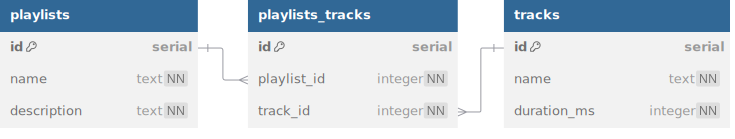

# Jukebox

Introducing Jukebox, a digital music service where users can curate playlists of tracks to
best match their mood!

## Database



<details>
<summary>See DBML</summary>

```dbml
table playlists {
  id serial [pk]
  name text [not null]
  description text [not null]
}

table playlists_tracks {
  id serial [pk]
  playlist_id integer [not null]
  track_id integer [not null]

  indexes {
    (playlist_id, track_id) [unique]
  }
}

table tracks {
  id serial [pk]
  name text [not null]
  duration_ms integer [not null]
}

Ref: playlists.id < playlists_tracks.playlist_id
Ref: tracks.id < playlists_tracks.track_id
```

</details>

There is a many-many relationship between playlists and tracks. If a junction table exists
purely to implement the many-many relationship, the convention is simply to combine the
names of the two linked tables.

1. Create a new database named `jukebox`.
2. Write `db/schema.sql` to create tables according to the schema above.
   - If either a playlist or a track is deleted, the deletion should cascade to all
     related playlists_tracks records.
   - Each track can only be in a playlist once. (Use a unique constraint!)
3. Complete `seed.js` and necessary queries to seed the database with at least
   20 tracks and 10 playlists. Create at least 15 playlists_tracks so that some of
   the seeded tracks belong to some of the seeded playlists.

## Server

Once your database is properly seeded, build an Express app that serves the following
endpoints. Remember to send appropriate status codes and error messages! You can use `npm
run test` to check your work as you build out these endpoints.

`/tracks` router

- `GET /tracks` sends array of all tracks
- `GET /tracks/:id` sends track specified by id

`/playlists` router

- `GET /playlists` sends array of all playlists
- `POST /playlists` creates a new empty playlist
- `GET /playlists/:id` sends playlist specified by id
- `GET /playlists/:id/tracks` sends all tracks in the playlist
- `POST /playlists/:id/tracks` adds a new track to the playlist
  - `trackId` should be sent in request body
  - Sends the created `playlist_track` with status 201
